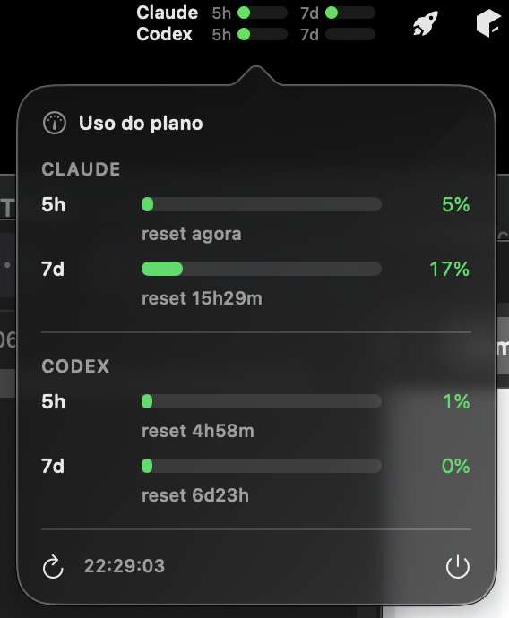

[🇬🇧 English](README.md) | 🇧🇷 Português

# AI Usage Bar

App nativo de **menu bar** do macOS que mostra, em tempo real, as janelas de rate-limit dos
planos **Claude Code** e **Codex**, com countdown de reset.



```
Claude 5h▕██░░░░░▏ 7d▕█░░░░░░▏
Codex  5h▕███░░░░▏ 7d▕░░░░░░░▏
```

- Duas linhas (Claude + Codex), duas barras cada: janela móvel de **5h** e janela de **7d**.
- Barra enche com **% usado** e muda de cor: verde &lt;80%, laranja ≥80%, vermelho ≥95%.
- Passe o mouse pro `%` exato + reset; clique pro popover com o detalhamento.
- Sem dashboards, sem login extra — reusa os tokens que os CLIs já guardam.

> Inspirado na receita de coleta do
> [oauramos/claude-usage-stick](https://github.com/oauramos/claude-usage-stick) (um monitor de
> hardware ESP32). Esta é uma reimplementação independente em Swift para macOS.

## Requisitos

- macOS 13+
- Xcode **Command Line Tools** (`xcode-select --install`) — não precisa do Xcode completo
- [Claude Code](https://claude.com/claude-code) e/ou [Codex CLI](https://developers.openai.com/codex/cli)
  instalados e logados (é de onde vêm os tokens)

## Instalar

```bash
git clone https://github.com/rafaelmgbh/ai-usage-bar.git
cd ai-usage-bar
./build.sh
open ~/Applications/AiUsageBar.app
```

Na 1ª execução o macOS pede **acesso ao Keychain** (token do Claude) → clique **"Sempre Permitir"**.
O app é assinado ad-hoc; como você mesmo compila, o Gatekeeper deixa rodar.

### Iniciar no login (opcional)

```bash
./autostart.sh on     # ativar
./autostart.sh off    # desativar
```

## Como funciona

| Provedor | Origem do token | Endpoint | Custo de quota |
|---|---|---|---|
| **Claude** | Keychain (`Claude Code-credentials` → `claudeAiOauth.accessToken`) | `POST api.anthropic.com/v1/messages` (probe `max_tokens:1`) → lê headers `anthropic-ratelimit-unified-{5h,7d}-{utilization,reset}` | ínfimo (1 request mínimo / refresh) |
| **Codex** | `~/.codex/auth.json` (`tokens.access_token` + `account_id`) | `GET chatgpt.com/backend-api/wham/usage` → `rate_limit.{primary,secondary}_window.{used_percent,reset_at}` | **nenhum** (endpoint de status) |

Atualiza a cada 5 minutos. O token é relido a cada ciclo, então quando o CLI o renova o app
pega o novo sozinho.

Estrutura do código:

| Arquivo | Papel |
|---|---|
| `Keychain.swift` / `UsageProbe.swift` | Claude: lê token + probe na Messages API |
| `CodexProbe.swift` | Codex: lê `auth.json` + `wham/usage` |
| `UsageModel.swift` | estado observável; atualiza os dois provedores em paralelo |
| `AppDelegate.swift` | `NSStatusItem` (imagem de 2 linhas desenhada) + `NSPopover` + timer 5min |
| `PopoverView.swift` | popover SwiftUI com as duas seções |
| `main.swift` | `NSApplication` em modo `.accessory` (sem ícone no Dock) |

## Privacidade & ressalvas

- Os tokens são lidos **localmente** e só vão pro endpoint do próprio provedor. Nada é
  armazenado, logado ou enviado pra outro lugar.
- Usa o token da sua **assinatura** — ok pra uso pessoal; você é responsável pelos Termos de
  Uso do provedor.
- O app **não** é assinado/notarizado pra distribuição (compile você mesmo).
- Se uma linha mostrar `token expirado`, abra o Claude Code / rode `codex` uma vez pro CLI
  renovar o token.

## Relacionados / alternativas

Se preferir uma ferramenta pronta, mantida e multi-provedor:
- [steipete/CodexBar](https://github.com/steipete/codexbar) — Codex + Claude + 40 provedores, widgets nativos
- [Nihondo/AgentLimits](https://github.com/Nihondo/AgentLimits) — WidgetKit + ccusage

## Licença

[MIT](LICENSE) © Rafael Araujo. Inspirado em
[oauramos/claude-usage-stick](https://github.com/oauramos/claude-usage-stick) (MIT).
